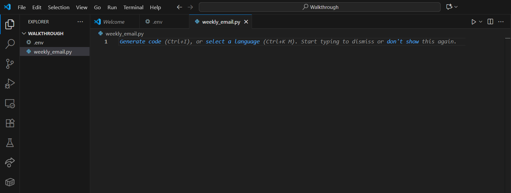

# How to Script Tasks using Python

By: Spencer Ord

10/2/25

## Introduction

Maybe you've seen a "scripting in powershell or python preferred" line in a job posting, or you've heard of automation but don't know what it is. Scripting will make your life easier when you learn how to apply it to the field you're in. 

Scripting is the process of taking an often repeated task and turning it into a script, or a program, that will either run itself or that you can run in a few commands. It saves time and energy that you can put towards something else. Unlike normal coding, which usually involves building an application from the ground up, scripting performs a specific task using other applications. 

To get a better understanding of what scripting can do, I will give you some common use cases:
- automatically backing up files every day on your computer
- extract data from a database daily, weekly, yearly, etc.
- sending out weekly reminder emails or updates
- automatically download files from the web

These examples are just the tip of the iceberg. There are so many possibilities! 

Tired of writing a weekly update email to your boss?
Tired of downloading certain files every day when you get to work? You can write a script for both! 
If you're in the cybersecurity field, you can write a script that scans logs for failed login attempts. 
In IT operations, you can have a script rename 1000 files all at once! 
If you do data analysis, you can automatically take data from a csv file or database and create a chart. 

Python is a popular programming language commonly used for scripting, and the one used in this walkthrough. There are several reasons for this:

1. It's easier to read, making for quicker learning and simpler work
2. Python has many pre-built libraries containing functions that you can use for handling automation, networking, or data to name just a few
3. It works on any platform, including Windows, Linux, and Mac

For our purposes today, I will demonstrate how to parse through a CSV file and present it as a table in excel. Before getting there though, we need to follow a pattern to ensure we are prepared. You can follow this pattern to identity what tasks you could write a script for.

1. Identify a repetitive task that you do a lot
2. Research and pick a library/tool that python has built-in
3. Write your script
4. Test/debug it in a safe environment
5. Schedule your script

It isn't an overly complicated process! Making sure you are prepared ahead of time will ensure writing your script is fast and efficient. Testing it in a safe environment ensures you don't mess anything up in your work or home environment. 

Scheduling is the final step, the step that saves you hours of time. Once we are done creating our excel report script and scheduling it to run automatically, you won't have to worry about it ever again. It will perform the task daily, weekly, or monthly.

### The Walkthrough

Today I want to familiarize you with several of the capabilities that python has. To do this, this walkthrough will focus on how to write a script that will do the following:

- take data from an excel file
- format it nicely
- send the nicely formatted file in an excel file to someone
- automate it to repeat weekly

This will familiarize you with how to use python, several of the libraries, and the process of scheduling it to run automatically. 

## Coding the Script in VS Code
### Initial Setup

This lab will give the instructions for a **Windows OS user**. A quick note here for non-Window users: most of this can be done on any OS because the majority is done in the VSCode application. The last step, scheduling the task, will differ depending on your OS. 

- Download VSCode if you don't already have it installed. Here is a link you can download it from: [VSCode](https://code.visualstudio.com/download)

- Ensure that Python is downloaded onto your device!!

- **Create a new folder** to contain all your files wherever you desire, and name it "Walkthrough" or something else if you desire. 

- Open VSCode, and click on the "Open Folder" button. Navigate to your newly made folder, and click select folder.

### Create Files
- In the left-hand panel that appears, you should see the word "WALKTHROUGH" (or the name of your folder you created). **Click on the icon that looks like a piece of paper with a +** in the bottom right corner found next to the name. This creates a new file. Name it **.env** and click enter.

- Now click on the same icon, and this time name the file **weekly_email.py**

- Do it again and create a file called **people.csv**

If your side pannel matches the following picture, you've done it right so far.



### .env

Your .env file is the file that contains the secrets, such as email addresses, passwords, etc, that you don't want to share with the world. It is good practice to keep these in this separate .env file so they remain safe.

- **Double click on the .env file** to open it on your main screen. It will be blank at first. Let's change that!

- Insert the following code into your .env file. Delete the comments (the #'s) and **input your unique variable**:

*Important Tip: A quick note about gmail's passwords: your normal one won't work. You need to generate a gmail app password so python can connect. Follow the steps found below the code to get that password.*

``` 
SMTP_HOST= # the provider's SMTP server hostname i.e. smtp.gmail.com
SMTP_PORT= # 587
SMTP_USER= # your full email i.e. spencer_o@spencer.com
SMTP_PASS= # your App password you generate
EMAIL_FROM= # your email in following format: Spencer O <spencer_o@spencer.com>
EMAIL_TO=  # who you want to send the email to
```

### Generate a Gmail App Password
1) Go to Google Account → Security → 2-Step Verification: **Turn it on if it isn't already**
1) Search: App passwords, type "Mail" as the name and click create.
1) Copy the 16-character code (no spaces).

You can see why you wouldn't want all of this information just laying around in your code! You wouldn't want your password floating around. If you use github, ensure that when you push it the .env is excluded.

### people.csv

- **Copy the following lines** into your people.csv file. This is the data we will be formatting and sending.
```
Last Name,First Name,Age,Date of Birth
Johnson,Emma,28,1997-04-12
Martinez,Daniel,35,1990-11-23
Kim,Sophia,41,1984-02-08
Patel,Arjun,32,1993-07-16
Smith,Olivia,26,1999-09-30
Brown,Ethan,38,1987-05-19
Nguyen,Ava,30,1995-12-02
Garcia,Lucas,45,1980-01-25
Lee,Mia,27,1998-06-10
Davis,Noah,33,1992-08-21
```

### Setup Python File

First we need to import the libraries and functions that we will be using. Python has tons of prebuilt libraries to use, but we have to install them first.

- In the top menu bar, there is a terminal button. Click on it and select new terminal
- run the following command:

```
python3 -m pip install pandas python-dotenv xlsxwriter
```
OR
```
pip install pandas python-dotenv xlsxwriter
```

- In the github repo where you found these instructions, copy and paste the code from starter_code.py into your personal weekly_email.py file.
- Complete all of the TO-DO's distributed throughout the code

The TO-DO comments will walk you through what you need to do and what the rest of the code is doing. Once all the TO-DO statements have been finished, move on to the next section. 

*Hint: If you are lost, feel free to google how to do something! The code tells you which functions to use, but not how those functions are formatted or what arguments they want. Look things up and be patient!*

*Extra Hint: There are some parts that are maybe more complicated than you are ready to do, and if you are only here to learn how to set up the automation at the end, you might want to skip this part. In the folder titled cheat_code on the github repo, you can find working code for your weekly_email.py that you can copy in.*

### Test it

- Open the terminal, and test your file to ensure it works. You can run it by typing python or python3 followed by your file name

```
python3 ./weekly_email.py
```

If it doesn't work, debug it until it works! Don't get frustrated, have fun with this part! Make sure you get an email that has the file attached!

## Let's Schedule It

On a Windows computer, you will schedule this script using the Task Scheduler. This program is already built into your OS.

### Python program path

First we need the path to where the python program resides.

- Open up the Command Prompt and then run:

```
where python
```

- Copy the full path somewhere you can easily access it. An example of what it should look like: C:\Users\<you>\AppData\Local\Programs\Python\Python312\python.exe

### Script path

Now we need the path to where your script, weekly_email.py, resides. Here is an example of what this might look like:

C:\Users\<you>\Desktop\Projects\weekly_report\weekly_email.py

*Tip: If you run WHERE PYTHON in the previous step and it returns multiple paths, try running the following command with each one of your paths. Whichever path works is the right one.* 
```
"Python Path" -u "Script Path"
```

### Create a Task

1. First press Windows + R, type taskschd.msc, and then press Enter.

2. Now Click Action → Create Task…

3. Go to the General tab

4. Name: Weekly CSV Email

5. Check the box for the following 

- “Run whether user is logged on or not”
- “Run with highest privileges”

6. Go to the Triggers tab → New…

7. Make sure the task begins: “On a schedule”

8. Choose Weekly and then pick your day and time (e.g., Mondays at 8:00 AM)

9. Go to the Actions tab → New…

10. Action: “Start a program”

11. Now it is time to use those paths you copied earlier

- Program/script: paste your python.exe path
(e.g. C:\Users\<you>\AppData\Local\Programs\Python\Python312\python.exe)

- Add arguments: "C:\Users\<you>\Projects\weekly_report\weekly_email.py"

- Start in: your project folder (so .env and CSV are found)
(e.g. C:\Users\<you>\Projects\weekly_report)

12. If it’s a laptop: For the conditions, make sure to uncheck “Start the task only if the computer is on AC power”

13. In the settings – check “Run task as soon as possible after a scheduled start is missed.”

### Time to Test it

Right-click on your new task → Run. Verify that it runs Python, creates report.xlsx, and sends the email.

That’s it — your Python report script will now run automatically once a week on Windows!

## Conclusion

Thanks for going through this walkthrough with me. Hopefully you have a better idea of what automation and scripting is, and how you can use it! Now, instead of spending 30 minutes every week editing an excel file, crafting an email, and sending it over, it will do it all without you spending any time at all! Scripting will make your job and life much easier, just learn how to use it!
